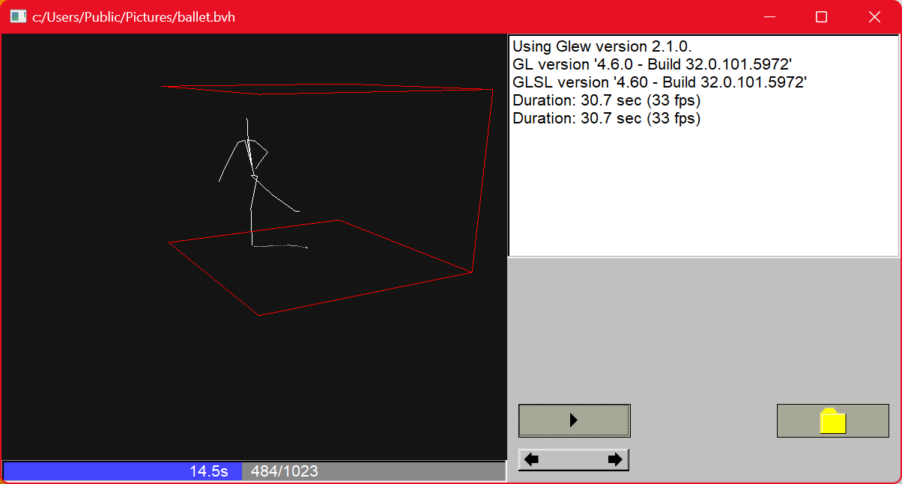

# Bhvparser

This is a library that parses .bvh (motion capture, BioVision Hierarchy) files to a C++ representation
of the skeleton and the motion. 

Two applications are included:

- **bvhtox3d** is a command line tool converts a .bvh file to a virtual reality file .x3d.
- **bvhshow** is a GUI application that reads .bvh-files and shows the animated skeleton.



# Requirements (for bvhshow)

- **flex** and **bison** tools for parser generation
- **glew** OpenGL binding
- **fltk** GUI Toolkit Version 1.4.1

# How to build

## .. on Linux

- Install **flex** and **bison**: ```sudo apt-get install flex bison``` or equivalent
- Make sure **glew** is installed
- Provide development files for fltk.
  If fltk 1.4.1 is not installed already, use the submodule included in this repository.

## .. or else on Windows (using Visual Studio 2022 (VS17))
 
- Easy way to install **flex** and **bison**: Download single executable implementations
  win_flex und win_bison from [here](https://sourceforge.net/projects/winflexbison/files/win_flex_bison3-latest.zip/download)
  and put them on the PATH. If you name them differently or don't want them on the path,
  adapt the Macros FLEX and BISON in buildsys/VS17/bvhparser.props.
- Easy way to provide development files for **glew**: Download the latest release (currently 2.2.0)
  of windows binary files from [here](https://github.com/nigels-com/glew/releases).<br/>
  Copy lib/Release/x64/glew32s.lib from the archive to lib/Release/glew32s.lib and
  lib/Debug/glew32s.lib in the repository.<br>
  Copy include/GL/\*.h from the archive to include/GL/ in the repository.<br/>
  If you have glew installed elsewhere, adapt paths and filenames in buildsys/VS17/UseGlew.props.
- If you have development files for fltk 1.4: Edit buildsys/VS17/UseFLTK.props to adapt
  file names and paths.<br/>
  Otherwise build from source (on windows command line):

    ```
    cd somewhere
    git clone https://github.com/fltk/fltk
    cmake -S fltk -B fltkbuild ^
        -D CMAKE_CONFIGURATION_TYPES="Debug;Release" ^
        -D FLTK_BUILD_EXAMPLES=0 ^
        -D FLTK_BUILD_FLTK_OPTIONS=0 ^
        -D FLTK_BUILD_TEST=0 ^
        -D FLTK_OPTION_FILESYSTEM_SUPPORT=0 ^
        -D FLTK_OPTION_SVG=0 ^
        -D FLTK_BUILD_FLUID=0
    ```

  Build the created solution. Adapt buildsys/VS17/UseFLTK.props to use the created files
  or copy libraries and headers to the given paths.
- Build bvhparser etc using buildsys/VS17/bvhparser.sln
